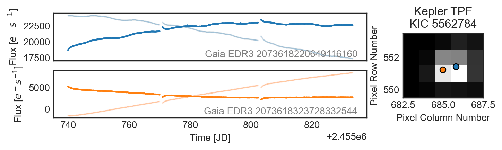
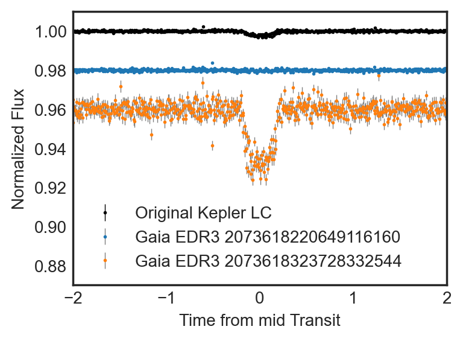

# PSFMachine

*PRF photometry with Kepler*

<a href="https://github.com/ssdatalab/psfmachine/workflows/tests.yml"></a>
<a href="https://pypi.python.org/pypi/tess-ephem"></a>
<a href="https://zenodo.org/record/4784073"></a>

`PSFMachine` is an open source Python tool for creating models of instrument effective Point Spread Functions (ePSFs), a.k.a Pixel Response Functions (PRFs). These models are then used to fit a scene in a stack of astronomical images. `PSFMachine` is able to quickly derive photometry from stacks of *Kepler* images and separate crowded sources.

# Installation

```
pip install psfmachine
```

# What's happening?

`PSFMachine` is doing a few things for you, it's

* using the *Gaia* archive to find all the sources in your images
* building a Pixel Response Function (PRF) model based on all the sources
* fitting the PRF to all the sources in an image stack, to find the best fitting flux of all sources, accounting for crowding and contamination
* returning neat, [`lightkurve.LightCurve`](https://docs.lightkurve.org/) objects of all the sources in the images, with all the available meta data.

# What does it look like?

After you run `PSFmachine` on a stack of images you can retrieve data like this. Here is an example of a very crowded *Kepler* [Object of Interest](https://exoplanetarchive.ipac.caltech.edu/overview/KOI-608) KOI-608. This object looks like a planet transit, but there are actually two targets almost exactly overlapping each other! You can see this on the right hand side, where an image of the target is shown with the two stars identified by *Gaia* highlighted.



The output of `PSFMachine` is on the right hand side, and shows two light curves, one for each source. `PSFMachine` has separated the light curves of these sources, despite the fact that they are separated by less than a pixel, and the background source is over 2 magnitudes fainter.

We can flatten and fold these light curves at the transit period to find the following



In black we see the original *Kepler* light curve, which looks like an exoplanet transit. When using `PSFMachine` to split these two sources, we see that the transit is actually around the orange target (which is fainter), and has been significantly diluted. `PSFMachine` is able to separate these sources with high confidence, and rule out the blue source as the origin of the transit.


# What can I use it on?

Currently `PSFMachine` is designed to work with *Kepler* data. The tool should work with *K2* or *TESS* data, but some of our key assumptions may break, and so mileage may vary. More work will be done on `PSFMachine` in the future to better integrate these datasets.

If you'd like to try using `PSFMachine` on a more generic dataset, you can try the `Machine` class instead of the `TPFMachine` class to work with more generic data.

# Example use

Below is an example script that shows how to use `PSFMachine`. Depending on the speed or your computer fitting this sort of model will probably take ~10 minutes to build 200 light curves. You can speed this up by changing some of the input parameters.

```python
import psfmachine as psf
import lightkurve as lk
tpfs = lk.search_targetpixelfile('Kepler-16', mission='Kepler', quarter=12, radius=1000, limit=200, cadence='long').download_all(quality_bitmask=None)
machine = psf.TPFMachine.from_TPFs(tpfs, n_r_knots=10, n_phi_knots=12)
machine.fit_lightcurves()
```

Funding for this project is provided by NASA ROSES grant number 80NSSC20K0874.
